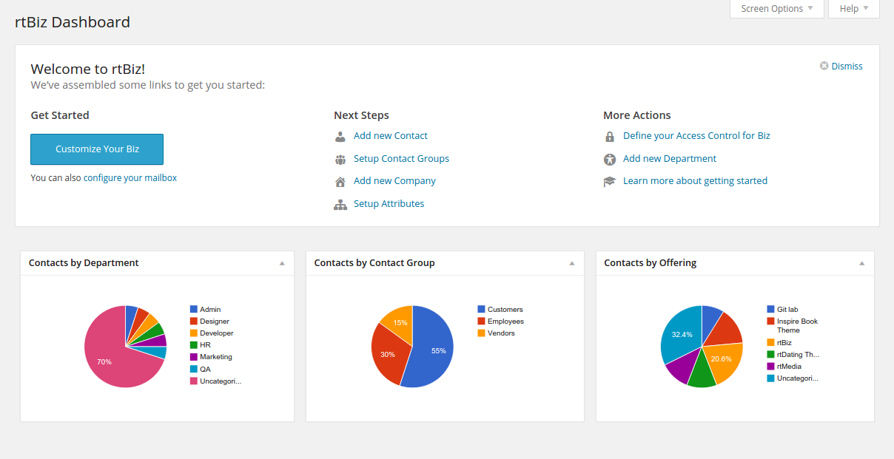
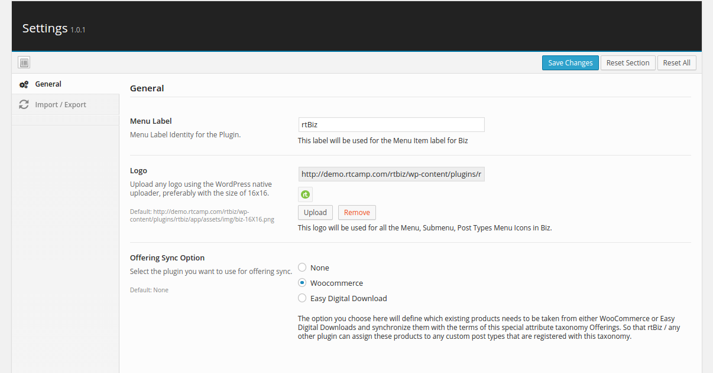
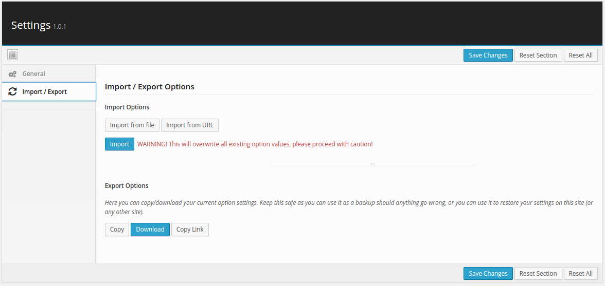
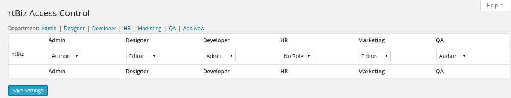
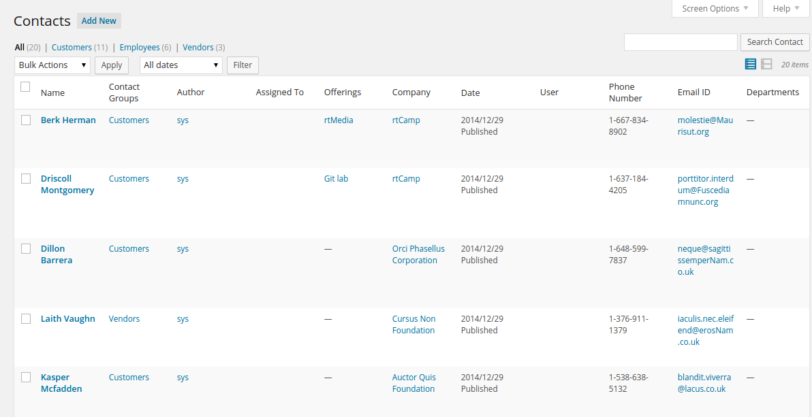
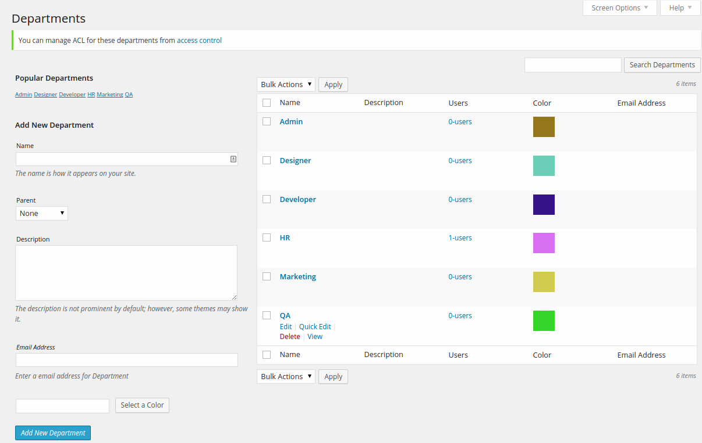

<!-- DO NOT EDIT THIS FILE; it is auto-generated from readme.txt -->
# rtBiz

rtBiz - WordPress 4 Business!

**Contributors:** [rtcamp](https://profiles.wordpress.org/rtcamp), [rahul286](https://profiles.wordpress.org/rahul286), [dipesh.kakadiya](https://profiles.wordpress.org/dipesh.kakadiya), [utkarshpatel](https://profiles.wordpress.org/utkarshpatel), [desaiuditd](https://profiles.wordpress.org/desaiuditd), [faishal](https://profiles.wordpress.org/faishal), [pareshradadiya](https://profiles.wordpress.org/pareshradadiya), [vaishu.agola27](https://profiles.wordpress.org/vaishuagola27/), [pooja1210] https://profiles.wordpress.org/pooja1210/), [milindmore22](https://profiles.wordpress.org/milindmore22), [delowardev] (https://profiles.wordpress.org/delowardev/)
**Tags:** [contacts](https://wordpress.org/plugins/tags/contacts), [companies](https://wordpress.org/plugins/tags/companies), [people management](https://wordpress.org/plugins/tags/people management), [business](https://wordpress.org/plugins/tags/business), [email parsing](https://wordpress.org/plugins/tags/email+parsing), [attributes](https://wordpress.org/plugins/tags/attributes), [user groups](https://wordpress.org/plugins/tags/user+groups), [access control](https://wordpress.org/plugins/tags/access+control), [acl](https://wordpress.org/plugins/tags/acl), [wordpress](https://wordpress.org/plugins/tags/wordpress)
**Requires at least:** 4.1
**Tested up to:** 5.9
**Stable tag:** 1.4.4
**License:** [GPLv2 or later](http://www.gnu.org/licenses/gpl-2.0.html)
**Donate Link:** http://rtcamp.com/donate

## Description ##

* *Mission Statement:* WordPress 4 Business
* *Centered Around Humans:* All modules are built around contact. Contacts are people who may or may not be WordPress users.
* *Contacts Management* - Easily manage all your clients, vendors and employee contacts.
* *Seamless Connections* - Connect contacts with any existing entity within WordPress environment on the fly.
* *Robust ACL* - Great control over who can access what data
* *MailBox Setup*  - Configure your mailbox to automate your processes such as support helpdesk using add-ons.
* *Attributes* - Define dynamic taxonomies to categorize all post types.
* *Offerings* - Easily sync your WooCommerce/EDD store’s products and services.
* Great reporting tools
* Easy import/export of information

**Important Links**

* [GitHub](http://github.com/rtcamp/rtbiz/) - Please mention your wordpress.org username when sending pull requests.

**License**

Same [GPL] (http://www.gnu.org/licenses/gpl-2.0.txt) that WordPress uses!

**Coming soon:**

 * Export Library
 * JSON API
 * UI Enhancements
 * New Enhancements

**See room for improvement?**

Great! There are several ways you can get involved to help make rtBiz better:

1. **Report Bugs:** If you find a bug, error or other problem, please report it! You can do this by [creating a new topic](https://github.com/rtcamp/rtbiz/issues) in the issue tracker.
2. **Suggest New Features:** Have an awesome idea? Please share it! Simply [create a new topic](https://github.com/rtcamp/rtbiz/issues) in the issure tracker to express your thoughts on why the feature should be included and get a discussion going around your idea.

## Installation ##

* Install the plugin from the 'Plugins' section in your dashboard (Go to `Plugins > Add New > Search` and search for rtBiz).
* Alternatively, you can [download](http://downloads.wordpress.org/plugin/rtbiz.zip "Download rtBiz") the plugin from the repository. Unzip it and upload it to the plugins folder of your WordPress installation (`wp-content/plugins/` directory of your WordPress installation).
* Activate it through the 'Plugins' section.
* rtBiz is closely coupled with [Posts 2 Posts](https://wordpress.org/plugins/posts-to-posts) plugin. So once you activate rtBiz, it will ask you to install & activate Posts 2 Posts plugin.

## Frequently Asked Questions ##

Please refer to the documentation.

## Screenshots ##

### rtBiz Dashboard

### General Settings

### Import/Export Settings

### rtBiz Access Control

### Contacts

### Companies

### Departments

## Changelog ##

### 1.4.4 ###
* Fixed PHP Warnings
* Compatible with WordPress 5.9

### 1.4.3 ###
* Removed deprecated function screen_icon.
* Compatibility testing with 5.6
* Change Text Domain

### 1.4.2 ###
* Fixed - JS issue with WordPress 4.5

### 1.4.1 ###
* Mail Lib updated
* Bug fixes

### 1.4 ###
* Added support for term meta (WordPress 4.4 and above)
* Gravity form importer update
* Redux updated

### 1.3.9 ###
* Mail lib updated
* Filters added for reply to header

### 1.3.8 ###
* error_log now only logs on wp_debug_log true

### 1.3.7 ###
* Mailbox library enhancements
* Fix import contact button
* Staff issue fixed
* Php version check added on plugin active
* Minor bug fixes

### 1.3.6 ###
* Mailbox library enhancements
* Minor bug fixes

### 1.3.5 ###
* Bug fixed

### 1.3.4 ###
* rtBiz Library mailbox and importer updates
* Bug fixed

### 1.3.3 ###
* Fix inline image issue with outlook while mail parsing
* bug fixed

### 1.3.2 ###
* Entity Meta filter added

### 1.3.1 ###
* Hot bug fixed

### 1.3 ###
* Skeleton update
* Slugs update
* Posts2Posts Lib added ( plugin dependency removed )

### 1.2.20 ###
* Contact Hooks change
* ACL metabox visible fix for admin
* lib updated

### 1.2.19 ###
* Fixed : Acl role not changed
* Add hook for Remove metabox
* Add hook for manage columns
* Contact backend update for add-on plugins

### 1.2.18 ###
* Fix wp user not connected with contact issue
* lib updated
* UX Changes
* Bug fix

### 1.2.17 ###
* Filter/Action added
* Mailbox Code updated
* Bug fix

### 1.2.16 ###
* Mailbox Code improved
* Bug fix

### 1.2.15 ###
* Mailbox Library updated
* Offering Library updated

### 1.2.14 ###
* Offering Library updated
* Docs move to docs.rtcamp.com

### 1.2.13 ###
* Acl code optimization
* Bug Fix

### 1.2.12 ###
* Bug Edd 'New Download Product' Draft Fixed

### 1.2.11 ###
* Offering sync updated
* Code optimization
* Bug Fix

### 1.2.10 ###
* Bug Fixes

### 1.2.9 ###
* Filter added for addon setting
* Redux version updated
* Helper Function added for addon
* Bug Fix

### 1.2.8 ###
* Remove Editor Support from contact and companies and added excerpt support
* rt-Lib Mailbox Library updated
* rtBiz helper function prefix updated
* Filters added for contacts & companies label
* Docs update
* Bug Fixes

### 1.2.7 ###
* Lots of Bug fixes

### 1.2.6 ###
* WP User => rtBiz Contact Importer added.
* Settings Refactoring
* Redux Library updated
* rt-Lib Library updated
* Lots of developer documentation added.
* Lots of Bug Fixes

### 1.2.5 ###
* Contacts Count on Department List View
* Dismiss link on products admin notice
* rtLib updated
* Mailbox UI proper labels & messages updated
* Bug Fixes

### 1.2.4 ###
* only root level Docs & Tests folders removed from svn.

### 1.2.3 ###
* Docs & Tests folders removed from svn.

### 1.2.2 ###
* Bug fixes.
* Extra directories removed from svn.

### 1.2.1 ###
* New Redux Framework updated.
* Input field validations added for Contacts & Companies additional information
* New test cases added for plugin functionality.
* New configuration page for Mailbox & Importer Setup
* Improved rtBot Comments : Added support for taxonomy changes.
* `dev-lib` updated
* Bug fixes

### 1.2 ###
* Import Library
* Recent Activity Widget on rtBiz Dashboard
* New developer friendly filters in Mailbox Library
* Bug Fixes related to rtBiz Comments, rtBiz Contacts

### 1.0.2 ###
* Banners updated
* Screenshots added
* Bug Fixes

### 1.0.1 ###
* Removed docs folder
* Removed dev files

### 1.0 ###
* Admin Pointers for User Tour Guide
* Mailbox Refactored
* rtBiz ACL Refactored
* UI Enhancements
* Bug Fixes

### 0.5.8 ###
* svn script updated

### 0.5.7 ###
* svn script updated

### 0.5.6 ###
* Lots of PHP Code Sniffer Fixes
* a few UX Changes ( Labels updated )
* svn-push script fix

### 0.5.5 ###
* Offering Page Menu Fix
* ACL Fix for CPT capability

### 0.5.4 ###
* assets bug fix

### 0.5.3 ###
* svn-push updated.
* Bug fixes

### 0.5.2 ###
* Correcting Contributors usernames
* Missing app folder

### 0.5.1 ###
* Correcting Contributors usernames
* Mailbox UI Refactoring
* Mailbox Bug Fixes

### 0.5 ###
* Beta Version Release on WordPress.org

### 0.1 ###
* Plugin Scaffolding
* Basic Functionality
* Travis Setup

## Upgrade Notice ##

### 1.4.3 ###
* Removed deprecated function screen_icon.
* Compatibility testing with 5.6
* Change Text Domain

## Does this interest you?

